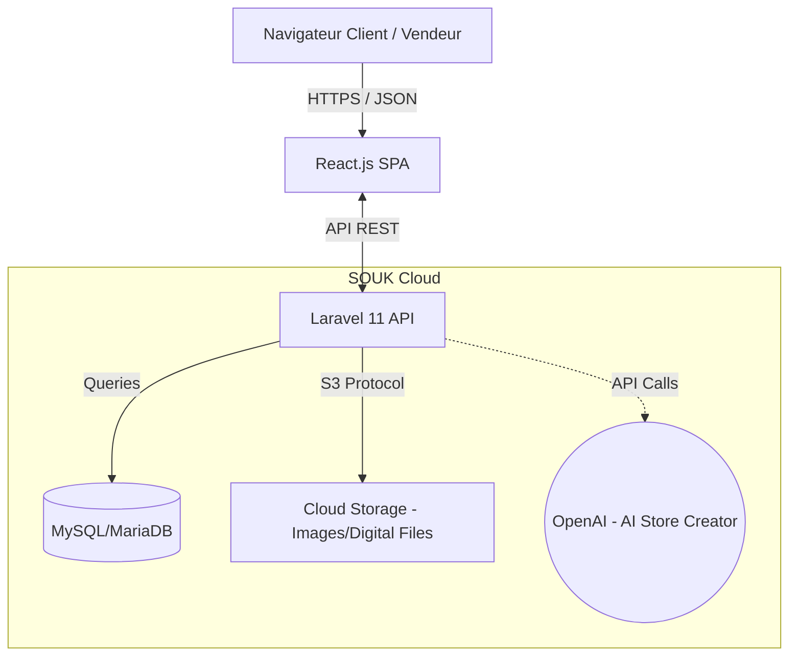

# Software Architecture Document (SAD) - SOUK ✦

> [!IMPORTANT]
> Ce document est conçu par votre **Software Architect (Antigravity)**. Il définit la topologie logique, l'arborescence physique de votre monorepo, et les patrons de conception (Design Patterns) utilisés pour garantir la scalabilité, la sécurité et la séparation des préoccupations dans le SaaS "SOUK".

## 1. Topologie Globale (Vue Hélicoptère)

Le projet adopte une architecture **Headless e-commerce** : une séparation stricte entre la couche de présentation (Frontend) et le système de traitement métier et la gestion des données (Backend). Les deux communiquent exclusivement via une API REST sécurisée.



## 2. Arborescence du Monorepo
La racine du projet est segmentée de manière modulaire, isolant le frontend et le backend.

```text
souk-project/
├── 📁 backend/                # Laravel 11 API (Logique Métier & BDD)
│   ├── app/
│   │   ├── Http/
│   │   │   ├── Controllers/   # Logique applicative par domaine
│   │   │   │   ├── Api/       # (AdminController, MarketplaceController...)
│   │   │   │   └── ...        # (Chat, Notifications, Auth)
│   │   │   └── Middleware/    # Filtres RBAC (SuperAdmin, Permissions)
│   │   ├── Models/            # Eloquent ORM (User, Store, Product, Team...)
│   │   └── Services/          # Centralisation logique complexe (AI, Billing)*
│   ├── routes/
│   │   └── api.php            # Cartographie de tous les endpoints
│   ├── database/
│   │   ├── migrations/        # Structure de DB en code (Version Control)
│   │   └── seeders/           # Données simulées (SaaSSeeder)
│   └── public/                # Expose du stockage local (temporaire)
│
├── 📁 frontend/               # Application React.js + Vite
│   ├── src/
│   │   ├── assets/            # Fonts, SVGs, Images (Moroccan Luxury)
│   │   ├── components/        # Composants réutilisables UI (Boutons, Cards)
│   │   ├── context/           # Gestion State global (AuthContext, ThemeContext)*
│   │   ├── pages/             # Pages complètes classées par domaine :
│   │   │   ├── admin/         # (Dashboard, RbacManagement, TeamLogin...)
│   │   │   ├── vendor/        # (VendorDashboard, ProductManager...)
│   │   │   └── client/        # (Storefront, Checkout...)
│   │   ├── services/          # Appels API (Axios local configuration)*
│   │   └── App.jsx            # React Router (Point d'entrée du routing)
│   └── index.css              # Design System Custom (Vanilla CSS / Tailwind)
│
└── 📁 docs/                   # Documentation du Projet (Cahier des charges, SAD)
```
*(Les dossiers marqués d'un astérisque \* sont recommandés pour la prochaine phase de refactoring).*

## 3. Design Patterns et Principes Techniques

### 3.1 Backend (Laravel)
- **MVC & Service Repository Pattern** : Les modèles (`Models`) représentent la base de données. Les contrôleurs ne doivent gérer que la requête/réponse JSON. La logique métier complexe (ex: facturation, IA) doit se faire via des `Services`.
- **JWT & Guards (RBAC)** : 
  - La sécurité est basée sur des Jetons JWT (`tymon/jwt-auth`). Les tokens stockent l'identité et les scopes de manière stateless.
  - Le système RBAC utilise les middlewares (`middleware('permission:logs.view')`) pour vérifier à la volée le droit du `Staff` ou `Admin` d'accéder à la ressource.
- **SaaS Isolation (Local Scopes / Tenancy)** : Chaque vendeur possède son propre domaine. Lorsqu'un vendeur interagit avec les produits, un *Global/Local Scope* garantit que le `Product::all()` ne ramène que *ses* produits.

### 3.2 Frontend (React)
- **Component-Based Architecture** : Chaque composant UI est atomique ou moléculaire. 
- **Context API pour le State Global** : L'état d'authentification (`AuthContext`) maintient le token et les données utilisateur sur toute la session. Cela conditionne également le Router (Protected Routes).
- **Design System "Moroccan Luxury"** : Centralisation des tokens de style (Or: `#D4AF37`, Sombre: `#121212`) dans `index.css` via des variables root `--color-primary`, `--font-main` (inter/playfair).

## 4. Modèle de Données (Entités Principales)

> [!NOTE]
> La base de données est structurée pour gérer la complexité multi-tenant.

| Entité | Rôle dans l'Architecture |
| :--- | :--- |
| **User** | L'entité polymorphe. Peut être Admin, Vendeur ou Client en fonction de son attribut `role`. S'il est vendeur, il possèdera des clés comme `store_slug`. |
| **Team / Role / Permission** | Gère le staff de SOUK. Un `User` intègre un `Team` via son `TeamMembership`, où on y attache un `Role` qui pointe vers des `Permissions`. |
| **Product** | Lié au Vendeur. Gère les assets physiques ou virtuels. |
| **Order / OrderItem** | Table de pivot et tracking. Calcul des commissions de la plateforme. |
| **Package** | Formules d'abonnement SaaS (Gratuit, Pro, Premium). Limite le quota (ex: `max_products`). |

## 5. Scalabilité & Cloud (Prochaines phases)

- L'API gérera les **Websockets** ou Polling pour le "Chat Real-time".
- Les tâches asynchrones comme "IA Store Generator" (appels OpenAI) devront utiliser des **Jobs en file d'attente (Queues)** sous Laravel (Redis) afin de ne pas bloquer la requête (`HTTP 504 Timeout`).
- **Paiements :** Intégration par webhook vers le fournisseur de paiement (CMI/Stripe) pour les vérifications asynchrones.
