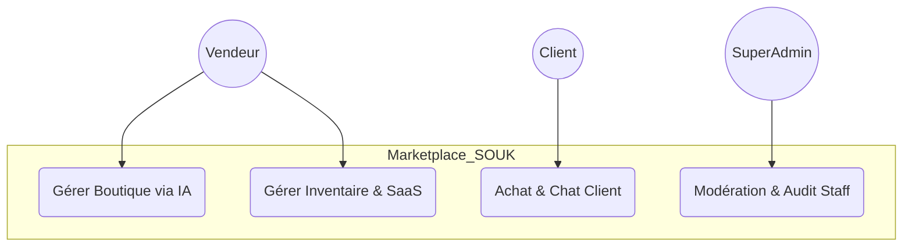
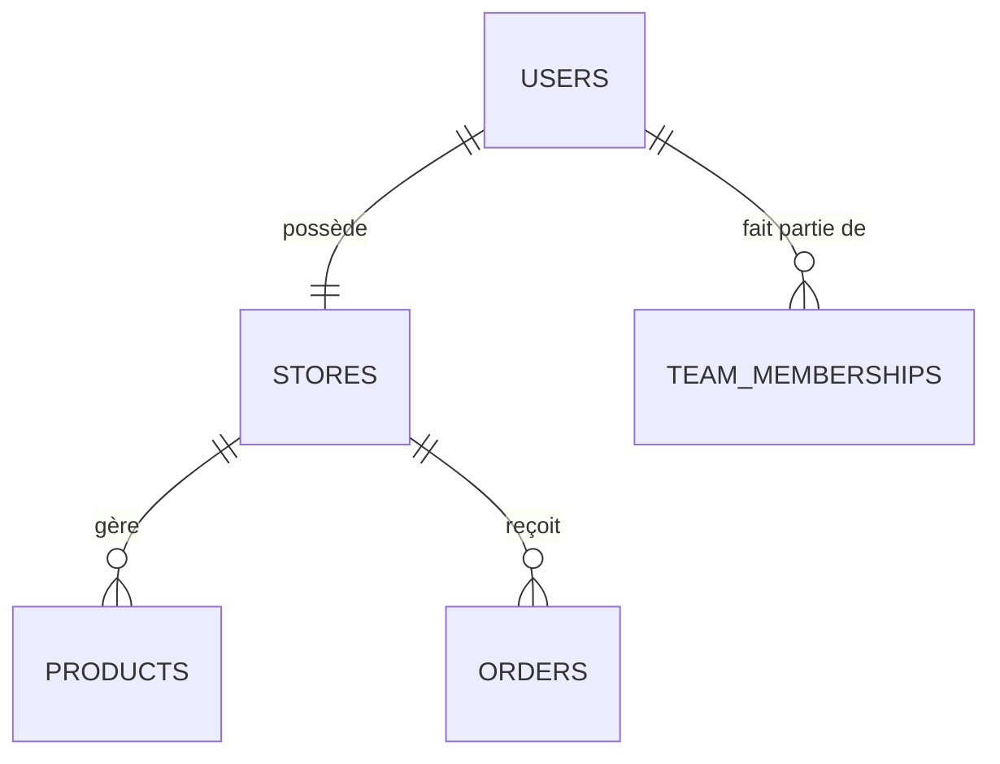

# 📘 RAPPORT DE STAGE : PROJET SOUK
## Conception et Réalisation d'une Plateforme SaaS Multi-tenant pour l'Artisanat

---

### 🏛️ PAGE DE GARDE (Modèle Académique)

**PROJET :** SOUK ✦ - L'Écosystème Digital de l'Artisanat  
**TYPE :** Rapport de Stage de Fin d'Études  
**FILIÈRE :** Génie Informatique / Développement Full-Stack  
**ANNÉE :** 2025 - 2026  

---

## 🕊️ DÉDICACE
À mes parents, pour leur amour inépuisable et leur soutien indéfectible durant toutes ces années d'études. À mes frères et sœurs, pour leur présence constante. À mes amis, pour les moments de partage et d'entraide.

---

## 🙏 REMERCIEMENTS
Je tiens à exprimer ma profonde gratitude à mon encadrant pour son temps, ses conseils techniques précieux et sa vision stratégique. Je remercie également l'équipe pédagogique pour la qualité de l'enseignement dispensé, qui a été le socle de la réalisation de ce projet ambitieux.

---

## 📑 SOMMAIRE
1. **Introduction Générale**
2. **Chapitre 1 : Présentation de l'Organisme d'Accueil**
3. **Chapitre 2 : Étude et Analyse du Projet**
4. **Chapitre 3 : Conception du Système**
5. **Chapitre 4 : Réalisation et Mise en Œuvre**
6. **Conclusion Générale**
7. **Annexes**

---

## 🖋️ INTRODUCTION GÉNÉRALE
Le secteur de l’artisanat au Maroc constitue un pilier économique et culturel majeur. Cependant, la fracture numérique reste un obstacle pour les petits créateurs. Le projet **SOUK ✦** a été conçu pour briser ces barrières en offrant une infrastructure **SaaS (Software as a Service)** capable d'automatiser la création de boutiques en ligne. Ce rapport présente le cycle de développement complet, de l'analyse des besoins à la mise en production d'une solution multi-tenant.

---

## 🏢 CHAPITRE 1 : PRÉSENTATION DE L'ORGANISME D'ACCUEIL
Le projet a été développé au sein de **SOUK TECH**, une startup fictive spécialisée dans les solutions de digitalisation de proximité.  
**Vision** : Devenir le leader du "Social Commerce" artisanal en Afrique du Nord.  
**Mission** : Fournir des outils technologiques d'élite (IA, Multi-tenancy) accessibles à tous les artisans.

---

## 🔍 CHAPITRE 2 : ÉTUDE ET ANALYSE DU PROJET

### 2.1 Problématique
Les solutions e-commerce actuelles (Shopify, Wix) imposent des coûts élevés et une complexité technique souvent rédhibitoire pour les artisans locaux. Le besoin est donc une plateforme centralisée mais offrant une identité propre à chaque vendeur.

### 2.2 Solution Proposée : SOUK ✦
Une architecture **Multi-tenant** où chaque vendeur dispose d'une instance de boutique isolée, gérée par une administration centrale. L'intégration de l'IA facilite la création de contenu (Fiches produits, logos).

### 2.3 Étude de Faisabilité
- **Technique** : Utilisation de Laravel (Backend) et React (Frontend) pour garantir performance et sécurité.
- **Économique** : Modèle SaaS permettant de mutualiser les coûts d'infrastructure.

---

## 📐 CHAPITRE 3 : CONCEPTION DU SYSTÈME

### 3.1 Analyse Fonctionnelle (Cas d'Utilisation)
Le système gère trois types de profils distincts via un moteur **RBAC** :
- **SuperAdmin** : Gouvernance, Audit, Gestion des équipes.
- **Vendeur** : Gestion boutique, produits, analytics.
- **Client** : Achat, Chat, Points de fidélité.

### 3.2 Modélisation des Données (ERD)
La base de données MySQL est structurée pour supporter l'isolation des données :
- `stores` : Table pivot contenant la configuration de chaque locataire.
- `teams` & `permissions` : Structure granulaire pour le staff interne.

---

## 🚀 CHAPITRE 4 : RÉALISATION ET MISE EN ŒUVRE

### 4.1 Environnement de Travail
- **Frameworks** : Laravel 11, React 18 (Vite).
- **Sécurité** : JWT (JSON Web Tokens) pour les API stateless.
- **Stockage** : Local Storage pour la persistance du panier client.

### 4.2 Présentation des Interfaces (Screenshots)

#### A. Vitrine Marketplace (Landing Page)

*L'interface d'accueil offre un design premium "SOUK Version Royale", alliant luxe et tradition.*

#### B. Flux Produits

*Le flux marketplace agrège les produits de tous les artisans avec une navigation fluide par catégories.*

#### C. Interface de Connexion Multi-tenant

*Une porte d'entrée unique gérant intelligemment les rôles (Vendeur, Client, Staff).*

---

## 🏁 CONCLUSION GÉNÉRALE
Ce projet de fin d'études a permis de relever des défis techniques majeurs, notamment l'isolation des données multi-tenants et l'intégration de services d'IA. La solution **SOUK ✦** est aujourd'hui une plateforme fonctionnelle, sécurisée et prête à transformer le paysage e-commerce de l'artisanat local.

---

## 📂 ANNEXES
- **Audit Logs** : Traçabilité des actions administratives.
- **RBAC Schema** : Matrice des permissions.
- **Guide d'installation** : `composer install && npm install`.

---
**Rédigé pour la soutenance de projet SOUK.**
