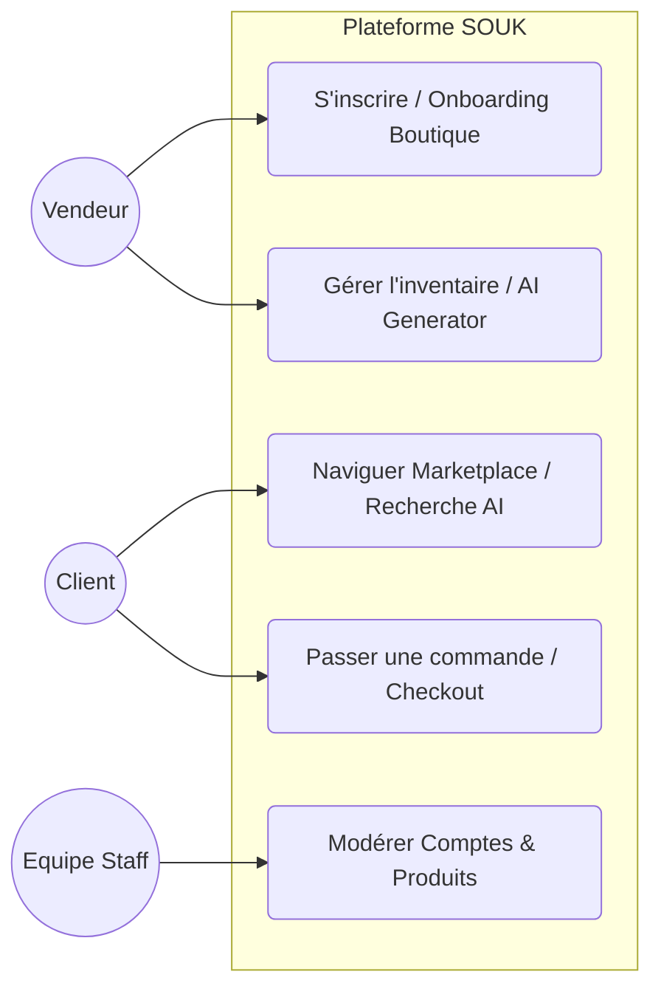
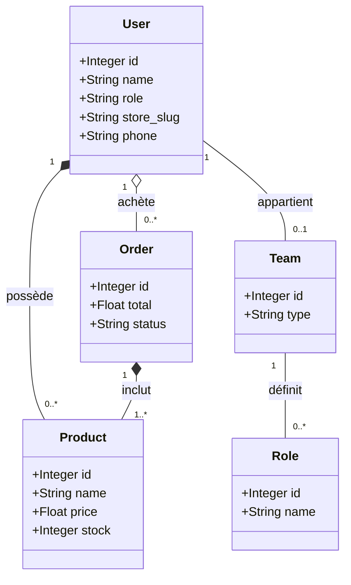
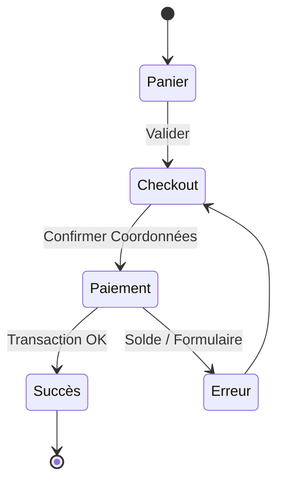
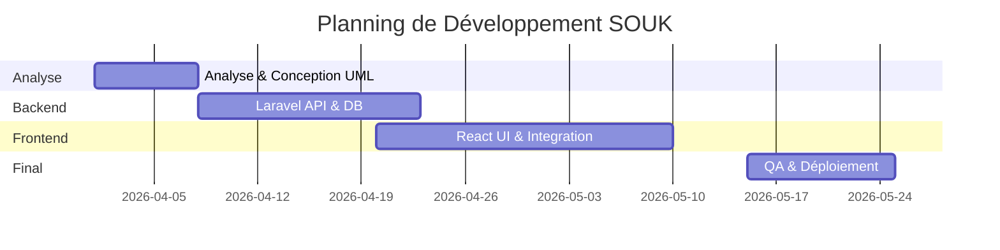
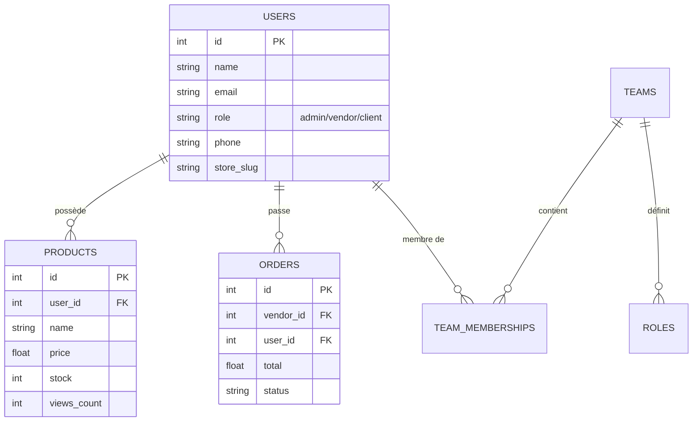

# Cahier de Conception Technique - Projet SOUK ✦

Ce document constitue le référentiel technique et architectural de la plateforme **SOUK ✦**. Il détaille les choix d'ingénierie, les modèles de données et l'organisation fonctionnelle du système.

---

## SOMMAIRE
1. [Contexte du projet](#1-contexte-du-projet)
2. [Acteurs et rôles](#2-acteurs-et-rôles)
3. [Fonctionnalités détaillées](#3-fonctionnalités-détaillées)
4. [Architecture technique](#4-architecture-technique)
5. [Diagrammes UML](#5-diagrammes-uml)
    5.1 [Diagramme de cas d'utilisation](#51-diagramme-de-cas-dutilisation)
    5.2 [Diagramme de classes](#52-diagramme-de-classes)
    5.3 [Diagramme d'activité](#53-diagramme-dactivité---processus-commande)
    5.4 [Diagramme PERT](#54-diagramme-pert---planning-8-semaines)
6. [Modèle de base de données (ERD)](#6-modèle-de-base-de-données-erd)
7. [Composants React principaux](#7-composants-react-principaux)
8. [Contraintes techniques et sécurité](#8-contraintes-techniques-et-sécurité)
9. [Tableau de bord projet](#9-tableau-de-bord-projet)
10. [Livrables attendus](#10-livrables-attendus)
11. [Exclusions](#11-exclusions)
12. [Signatures](#12-signatures)

---

## 1. Contexte du projet
**SOUK ✦** est une plateforme SaaS (Software as a Service) multi-tenant conçue pour révolutionner le commerce de l'artisanat de luxe au Maroc. Elle permet à des créateurs et artisans de générer instantanément des boutiques en ligne haut de gamme tout en offrant une marketplace centralisée pour les acheteurs.

La vision repose sur trois piliers :
- **Luxe et Authenticité** : Une esthétique "Moroccan Luxury" (Or, Cuivre, Zellige).
- **Simplicité Assistée par IA** : Génération de boutiques et de contenus pour réduire la barrière technique.
- **Transparence et Sécurité** : Une infrastructure RBAC robuste pour la gestion interne et des paiements.

---

## 2. Acteurs et rôles
Le système orchestre quatre niveaux d'utilisateurs distincts via un système de Role-Based Access Control (RBAC).

### 2.1 Équipe Administration (Staff)
- **SuperAdmin** : Gestion totale. Supervision des équipes (Finance, Modération), management des packages SaaS et accès aux audits logs.
- **Équipe Modération** : Validation des boutiques et produits. Gestion de la file d'attente d'approbation.
- **Équipe Finance** : Suivi des commissions sur les ventes, validation des abonnements payants et analytique financière globale.

### 2.2 Vendeurs (Tenants)
- **Vendeur (Vendor)** : Propriétaire de boutique. Il dispose d'un tableau de bord pour gérer ses produits, voir ses statistiques de vente, personnaliser son thème et communiquer avec ses clients.

### 2.3 Clients (Acheteurs)
- **Client (Acheteur)** : Utilisateur final de la marketplace. Il peut parcourir la Marketplace, suivre ses boutiques préférées, passer des commandes et accumuler des points de fidélité.

---

## 3. Fonctionnalités détaillées
La plateforme implémente **25 fonctionnalités critiques** :

### 🧠 Intelligence Artificielle (AI Services)
1. **AI Store Creator** : Génération de l'identité visuelle (Thème, Logo, Descriptions).
2. **AI Product Generator** : Création automatique de fiches produits à partir de simples mots-clés.
3. **Smart Search AI** : Recherche prédictive et sémantique dans la marketplace.

### 🏪 Marketplace Multi-Tenant
4. **Boutiques Isolées** : Chaque vendeur a son URL, son stock et ses propres clients.
5. **Dashboard Vendeur** : Analyse des ventes, revenus et métriques de visites en temps réel.
6. **Customization Engine** : Outil de personnalisation de l'UI de la boutique (couleurs, polices).

---

## 4. Architecture technique
### 4.1 Stack Technologique
- **Backend** : Laravel 11 (Headless API RESTful).
- **Frontend** : React 18 (Vite, Context API).
- **Authentification** : JWT (JSON Web Token) via Tymon/JWTAuth.

### 4.2 Patterns de Conception
- **Multi-tenancy Scoping** : Utilisation d'un `TenantScope` pour isoler les données.
- **RBAC Middleware** : Contrôle des accès administratifs via un middleware `CheckPermission`.

---

## 5. Diagrammes UML

### 5.1 Diagramme de cas d'utilisation

### 5.2 Diagramme de classes

### 5.3 Diagramme d'activité - Processus commande

### 5.4 Diagramme PERT - Planning 8 semaines

---

## 6. Modèle de base de données (ERD)

---

## 7. Composants React principaux
L'architecture est modulaire et divisée par contexte :

- **Contextes** :
  - `AuthContext` : Gestion du token vendeur.
  - `ClientAuthContext` : Gestion du token client.
  - `CartContext` : Gestion du panier local.
- **Pages Clés** :
  - `Landing.jsx` : Exploration Marketplace.
  - `StoreFront.jsx` : Vitrine dynamique du vendeur.
  - `StoreCheckout.jsx` : Processus de commande dynamique.
  - `Dashboard.jsx` : Statistiques vendeur (Revenus, Top Produits).

---

## 8. Contraintes techniques et sécurité
- **Sécurité** :
  - Utilisation de **JWT** pour toutes les sessions API.
  - Isolation des données par **TenantScope** (un vendeur ne peut pas voir les produits d'un autre).
  - Validation stricte via **Laravel FormRequests**.
- **Performance** :
  - Optimisation des assets via **Vite**.
  - Chargement asynchrone des données via **React useEffect** et **Axios**.

---

## 9. Tableau de bord projet
### 9.1 Informations générales
- **Date de début** : 01 Avril 2026
- **Date de fin prévue** : 30 Mai 2026
- **Équipe** : Akram (Lead Backend), Mohammed (Lead Frontend)

### 9.2 Suivi budgétaire
- **RH** : 90,000 MAD (2 devs × 3 mois)
- **Infrastructure** : 4,550 MAD (VPS, Domaine, API AI)
- **Total** : **94,550 MAD**

---

## 10. Livrables attendus
1. Code source (Frontend & Backend).
2. Scripts de migration et Seeders.
3. Cahier de Conception Technique.
4. Manuel d'utilisation Vendeur.

---

## 11. Exclusions
- Intégration bancaire réelle (utilisation de simulateurs).
- Applications mobiles natives.
- Intégration API transporteurs externes.

---

## 12. Signatures
| Rôle | Signature | Date |
| :--- | :--- | :--- |
| **Lead Architecte** | | |
| **Lead Frontend** | | |
| **Sponsor Projet** | | |
