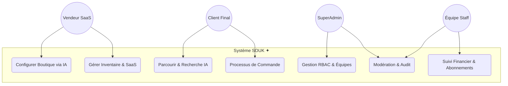
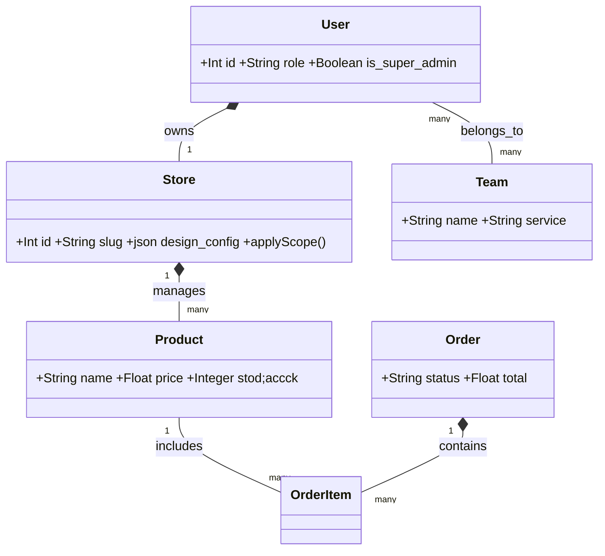
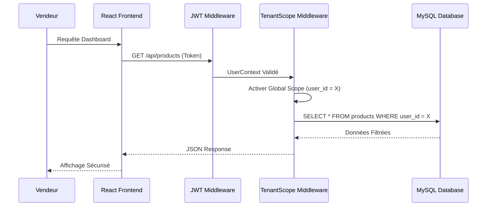
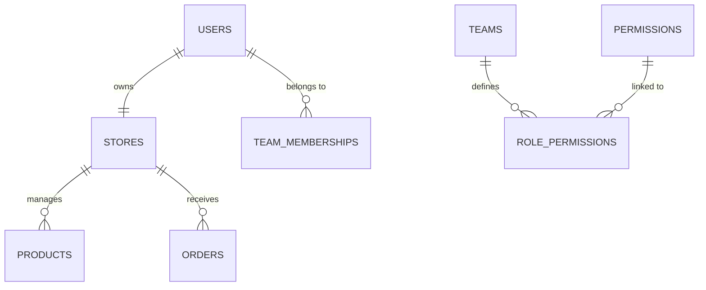

# Cahier de Conception et d'Analyse - Projet SOUK ✦

**SaaS Marketplace Multi-tenant & Intelligence Artificielle**

---

## 📑 SOMMAIRE
1. [Contexte du projet](#1-contexte-du-projet)
2. [Acteurs et rôles](#2-acteurs-et-rôles)
3. [Fonctionnalités détaillées](#3-fonctionnalités-détaillées)
4. [Architecture technique](#4-architecture-technique)
5. [Diagrammes UML](#5-diagrammes-uml)
6. [Modèle de base de données (ERD)](#6-modèle-de-base-de-données-erd)
7. [Composants React principaux](#7-composants-react-principaux)
8. [Contraintes techniques et sécurité](#8-contraintes-techniques-et-sécurité)
9. [Tableau de bord projet](#9-tableau-de-bord-projet)
10. [Livrables attendus](#10-livrables-attendus)
11. [Exclusions (non inclus)](#11-exclusions-non-inclus)
12. [Signatures](#12-signatures)

---

## 1. Contexte du projet
Le projet **SOUK ✦** est une infrastructure de transformation digitale conçue pour l'écosystème artisanal marocain. 

### 1.1 Problématique
Les artisans locaux souffrent d'une fracture numérique et de la complexité des outils e-commerce classiques. SOUK ✦ répond à ce besoin en simplifiant radicalement la présence en ligne.

### 1.2 Vision et Proposition de Valeur
En adoptant une architecture SaaS Multi-tenant, SOUK ✦ offre :
*   **Accessibilité Immédiate** : Création de boutique en < 2 minutes.
*   **Coûts Partagés** : Infrastructure mutualisée réduisant les frais pour les petits artisans.
*   **Intelligence Assistée** : L'IA compense l'absence de compétences en marketing/design.

---

## 2. Acteurs et rôles
Le système utilise un modèle de sécurité **RBAC (Role-Based Access Control)** hiérarchique pour une séparation nette des responsabilités.

| Acteur | Responsabilité Principale | Permissions Clés |
| :--- | :--- | :--- |
| **SuperAdmin** | Gouvernance globale | Gestion des rôles, Audit logs, Config SaaS |
| **Modérateur** | Qualité du catalogue | Validation boutiques, Signalements |
| **Financier** | Flux monétaires | Validation abonnements, Commissions |
| **Vendeur** | Gestion opérationnelle | Inventaire, IA Design, Commandes |
| **Client** | Consommation | Achat, Fidélité, Chat temps réel |

---

## 3. Fonctionnalités détaillées

### 3.1 Suite Intelligence Artificielle
*   **AI Store Creator** : Analyse du projet pour générer l'identité de marque (Logo, Couleurs, Slogan).
*   **AI Product Optimizer** : Génération de fiches produits SEO-friendly avec descriptions persuasives.

### 3.2 Moteur SaaS & Multi-tenancy
*   **Isolation des Données** : Etanchéité totale via les Scopes Eloquent (`TenantScope`).
*   **Customization Engine** : Éditeur de thème en temps réel pour personnaliser la vitrine sans coder.

---

## 4. Architecture technique
La stack a été choisie pour sa robustesse et sa capacité à gérer le multi-tenant.

*   **Backend (Laravel 11)** : Choisi pour sa gestion native des gardes d'authentification et son ORM puissant facilitant le scoping des données.
*   **Frontend (React 18)** : Utilisation de Context API pour la gestion d'état globale et de Vite pour des performances optimales.
*   **Services** : OpenAI/Gemini pour l'IA, JWT pour la sécurité des API, MySQL pour la persistance.

---

## 5. Diagrammes UML
Ces schémas modélisent le fonctionnement réel et spécifique du projet SOUK ✦.

### 5.1 Diagramme de Cas d'Utilisation Global

### 5.2 Diagramme de Classes Technique

### 5.3 Diagramme de Séquence (Isolation SaaS)

---

## 6. Modèle de base de données (ERD)
Le schéma relationnel est optimisé pour le RBAC et l'isolation multi-tenant.

### 6.1 Dictionnaire de données simplifié
*   **Users** : `role` (staff/vendor/client), `loyalty_points`.
*   **Stores** : `slug` (unique identifier), `design_config` (IA settings).
*   **Teams** : `service` (moderation/finance/delivery).

---

## 7. Composants React principaux
L'architecture frontend est divisée en écosystèmes modulaires :
*   **Admin Dashboard** : Modules de modération, audit logs et gestion RBAC.
*   **Vendor Dashboard** : AI Store Creator, Products Manager, Analytics.
*   **Client Storefront** : Marketplace global, Chat temps réel, Smart Checkout.

---

## 8. Contraintes techniques et sécurité
*   **Sécurité** : Protection CSRF, Chiffrement JWT, et Scoping de données au niveau ORM (Interdiction d'accès inter-tenant).
*   **Performance** : Caching des configurations de boutique et Lazy Loading des composants lourds.

---

## 9. Tableau de bord projet

### 9.1 Matrice des Risques
| Risque | Impact | Mesure d'Atténuation |
| :--- | :--- | :--- |
| **Fuite Multi-tenant** | Critique | Tests unitaires systématiques sur les Scopes DB |
| **Coûts API IA** | Moyen | Rate limiting et Caching des réponses |

### 9.2 Suivi Budgétaire & Planning
*   **Infrastructure** : VPS Cloud (150 MAD/mois).
*   **Planning** : 8 semaines (Analyse -> Backend -> Frontend -> QA).

---

## 10. Livrables attendus
1. Code source (Frontend & Backend).
2. Scripts de migration et Seeders.
3. Documentation technique (Ce document).
4. Démonstration vidéo.

---

## 11. Exclusions (non inclus)
*   Applications mobiles natives (Focus Web Responsive).
*   Intégration réelle de passerelle de paiement (Simulation uniquement).

---

## 12. Signatures

| Rôle | Nom & Prénom | Signature |
| :--- | :--- | :--- |
| **Concepteur** | ________________ | |
| **Encadrant** | ________________ | |
