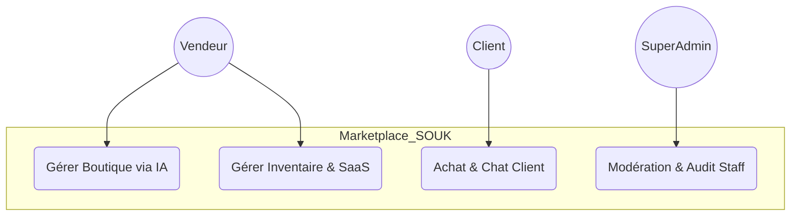
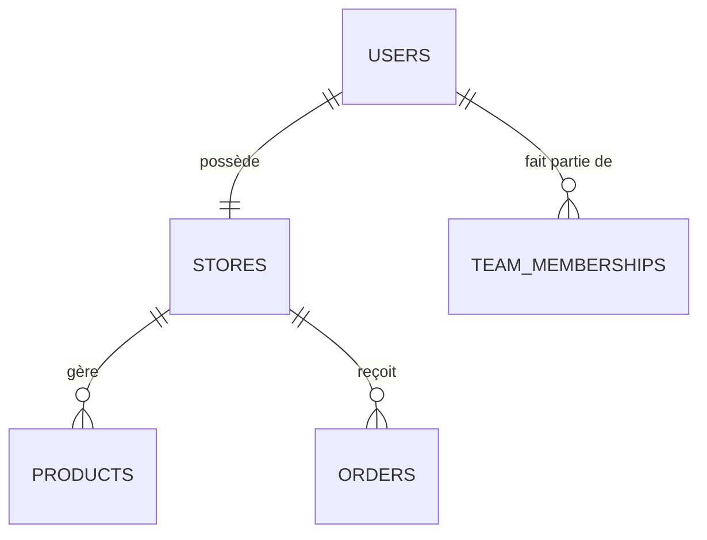

# RAPPORT DE PROJET DE SYNTHÈSE : SOUK ✦
## Conception et Réalisation d'une Plateforme SaaS Multi-tenant E-commerce Multi-Catégories

**Réalisé par :** Akram Sabouni & Yousfi Mohammed  
**Filière :** Génie Informatique / Développement Full-Stack  
**Année Universitaire :** 2025 - 2026

---

## 🕊️ DÉDICACE
À nos parents, pour leur amour inépuisable et leur soutien indéfectible durant toutes ces années d'études. À nos frères et sœurs, pour leur présence constante. À nos amis, pour les moments de partage et d'entraide. Ce travail est le fruit de votre soutien.

---

## 🙏 REMERCIEMENTS
Nous tenons à exprimer notre profonde gratitude à notre professeure encadrante, **Madame Amira**, pour son temps, ses conseils techniques précieux et sa vision stratégique tout au long de ce projet de synthèse. Ses orientations ont été fondamentales pour l'aboutissement de ce travail ambitieux.

Nous remercions également l'équipe pédagogique pour la qualité de l'enseignement dispensé, qui a été le socle de notre formation, ainsi que toutes les personnes ayant contribué de près ou de loin à la réussite de ce projet.

---

## 📑 SOMMAIRE
1. **Introduction Générale**
2. **Chapitre 1 : Présentation du Projet & Contexte**
3. **Chapitre 2 : Analyse des Besoins (Cahier des Charges)**
4. **Chapitre 3 : Conception Technique (Architecture & Modélisation)**
5. **Chapitre 4 : Réalisation & Technologies**
6. **Chapitre 5 : Fonctionnalités & Expérience Utilisateur**
7. **Chapitre 6 : Tests, Validation & Budget**
8. **Conclusion Générale & Perspectives**
9. **Annexes**

---

## 🖋️ INTRODUCTION GÉNÉRALE
Le commerce digital au Maroc connaît une croissance exponentielle, mais de nombreux créateurs et entrepreneurs peinent encore à trouver des solutions de vente en ligne qui allient prestige, simplicité et puissance technologique. Initialement conçu pour le secteur de l'artisanat, le projet **SOUK ✦** a évolué pour devenir une infrastructure **SaaS (Software as a Service)** multi-catégories d'élite. Il permet d'automatiser la création de boutiques en ligne luxueuses pour tout type de produit (Artisanat, Mode, Technologie, Bien-être). Ce rapport détaille l'intégralité du cycle de développement, de l'analyse initiale à la mise en œuvre technique d'une plateforme d'excellence.

---

## 🏢 CHAPITRE 1 : PRÉSENTATION DU PROJET & CONTEXTE

### 1.1 Vision du Projet
**SOUK ✦** n'est pas seulement une place de marché ; c'est un écosystème digital universel. Sa vision est de devenir le leader du "Social Commerce" multi-catégories au Maroc et en Afrique du Nord, en fournissant des outils technologiques d'élite (IA, Multi-tenancy) accessibles à tous les créateurs d'excellence.

### 1.2 Équipe Projet
Le développement a été assuré par un binôme complémentaire :
- **Akram Sabouni** : Architecte Backend & Intégration IA (Laravel).
- **Yousfi Mohammed** : Lead UI/UX & Développement Frontend (React).

### 1.3 Stack Technique
- **Backend** : Laravel 11 (Headless API).
- **Frontend** : React.js (Vite), Vanilla CSS (Style Luxe Marocain).
- **IA** : OpenAI GPT-4 (Génération de contenu) et Midjourney (Inspiration Design).
- **Infrastructure** : VPS Cloud, MySQL, Redis (Caching).

---

## 🔍 CHAPITRE 2 : ANALYSE DES BESOINS

### 2.1 Public Cible (Personas)
- **Le Créateur d'Excellence** : Qu'il soit artisan, designer de mode ou entrepreneur tech, il cherche une vitrine premium sans complexité technique.
- **La Marque de Prestige** : Entité cherchant à valoriser son identité de marque et à automatiser sa croissance.
- **Le Client "Luxe & Modernité"** : Acheteur recherchant des produits d'exception et une expérience de navigation fluide et innovante.

### 2.2 Fonctionnalités Détaillées (Les 25 Features Clés)

#### 🧠 Module Intelligence Artificielle
1. **AI Store Creator** : Génération automatique de l'identité visuelle (Logo, Couleurs).
2. **AI Product Generator** : Création automatique des fiches produits (Titres, Descriptions).
3. **Smart Search AI** : Moteur de recherche intelligent par langage naturel.

#### 🏪 Architecture Marketplace
4. **Stores Indépendants** : Chaque vendeur possède son propre sous-domaine logique.
5. **Dashboard Vendeur** : Statistiques de ventes, gestion de stock et revenus.
6. **Personnalisation Totale** : Modification des thèmes et polices en temps réel.

#### 📱 Social Commerce
7. **Social Feed** : Système d'interaction (Follow, Like, Share).
8. **Trending System** : Mise en avant des produits les plus populaires.
9. **Storytelling** : Vidéos et récits sur l'origine des produits.

#### 💬 Communication & Ventes
10. **Chat Temps Réel** : Messagerie instantanée entre acheteurs et vendeurs.
11. **Checkout Intelligent** : Calcul automatique des taxes, frais de port et points de fidélité.
12. **Custom Orders** : Possibilité de passer des commandes sur-mesure.

#### 🏷️ Logistique & Administration
13. **Vendor Types** : Interfaces adaptées à chaque métier (Artisanat, Mode, Tech, Cosmétique).
14. **Produits Digitaux** : Support des fichiers téléchargeables sécurisés.
15. **Delivery Zones** : Gestion des tarifs par zone géographique.
16. **Forfaits SaaS** : Modèle Freemium, Pro et Premium.
17. **Team Management (RBAC)** : Gestion des rôles internes (SuperAdmin, Support, etc.).
18. **Activity Logs** : Traçabilité totale des actions administratives.
*(Et autres fonctionnalités incluant : Géolocalisation, Système de Points, Badges de confiance, etc.)*

---

## 📐 CHAPITRE 3 : CONCEPTION TECHNIQUE

### 3.1 Architecture Multi-tenant
L'architecture repose sur une isolation logique des données. Chaque requête HTTP est filtrée par un identifiant de boutique (`tenant_id`), garantissant qu'un vendeur n'accède qu'à ses propres données.

### 3.2 Diagramme de Cas d'Utilisation
Le système gère les interactions entre les trois acteurs principaux.

### 3.3 Modélisation des Données (ERD)
La base de données est optimisée pour la performance et la sécurité.

---

## 🚀 CHAPITRE 4 : RÉALISATION & TECHNOLOGIES

### 4.1 Environnement de Développement
Nous avons utilisé une approche **API-First** :
- **Backend (Laravel)** : Gestion de la logique métier, de l'isolation SaaS et des intégrations IA.
- **Frontend (React)** : Création d'une application monopage (SPA) fluide et réactive.
- **Sécurité (JWT)** : Authentification sans état pour une sécurité maximale des échanges.

### 4.2 Flux de l'IA (Explication Technique)
Le processus de génération automatique suit ce schéma :
1. L'utilisateur saisit un mot-clé (ex: "Cuir de Fès").
2. Le serveur Laravel envoie un prompt optimisé à **OpenAI GPT-4**.
3. La réponse est formatée et injectée dans la base de données.
4. L'interface React se met à jour instantanément pour afficher le résultat.

---

## 📈 CHAPITRE 5 : TESTS, VALIDATION & BUDGET

### 5.1 Planification et Budget (94 550 MAD)
Le projet a été budgétisé pour un lancement de startup viable au Maroc.

| Catégorie | Détail | Coût Estimé (MAD) |
| :--- | :--- | :--- |
| **Ressources Humaines** | Équipe de 2 Développeurs (3 mois) | 90 000 MAD |
| **Hébergement Cloud** | VPS, Redis, MySQL | 2 400 MAD |
| **API & Outils** | OpenAI GPT-4, Figma, SSL | 2 150 MAD |
| **TOTAL** | | **94 550 MAD** |

### 5.2 Tests et Validation
Des tests rigoureux ont été effectués :
- **Tests d'isolation** : Vérification qu'aucun vendeur ne peut voir les commandes d'un autre.
- **Tests de Charge** : Optimisation des temps de réponse via Redis.
- **Tests UI/UX** : Validation du responsive design sur mobile et desktop.

---

## 🏁 CONCLUSION GÉNÉRALE
Ce projet de fin d'études a permis de démontrer qu'une solution SaaS moderne, couplée à l'intelligence artificielle, peut redéfinir les standards de l'e-commerce au Maroc. **SOUK ✦** a évolué d'un projet de niche pour l'artisanat vers une plateforme universelle d'excellence. Elle est aujourd'hui fonctionnelle, sécurisée et prête à propulser n'importe quel créateur marocain vers une présence digitale de rang mondial. L'expérience acquise durant ce développement nous ouvre des perspectives passionnantes dans le domaine de l'architecture logicielle et de l'IA appliquée au business.

---

## 📂 ANNEXES
- **Captures d'écran des interfaces** : Disponibles dans le dossier `/annexes`.
- **Dictionnaire de données** : Liste complète des tables et attributs.
- **Matrice des permissions (RBAC)** : Détail des droits d'accès par rôle.

---
**Rapport de Projet de Synthèse - SOUK ✦ - 2026**
