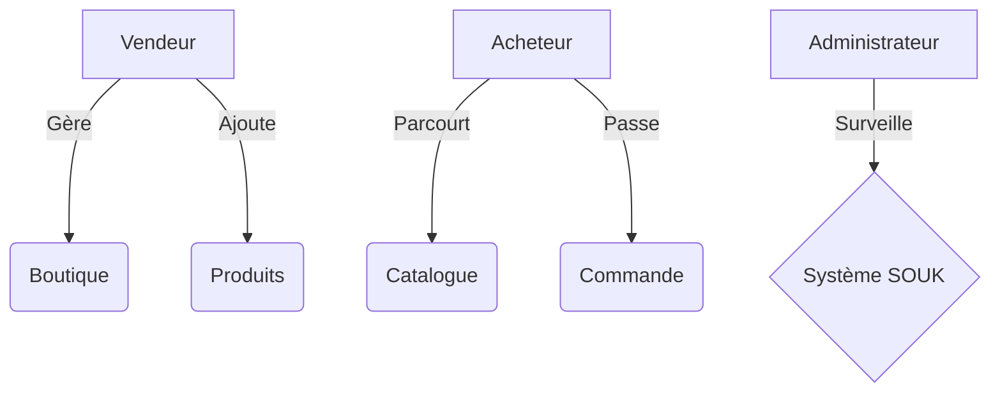
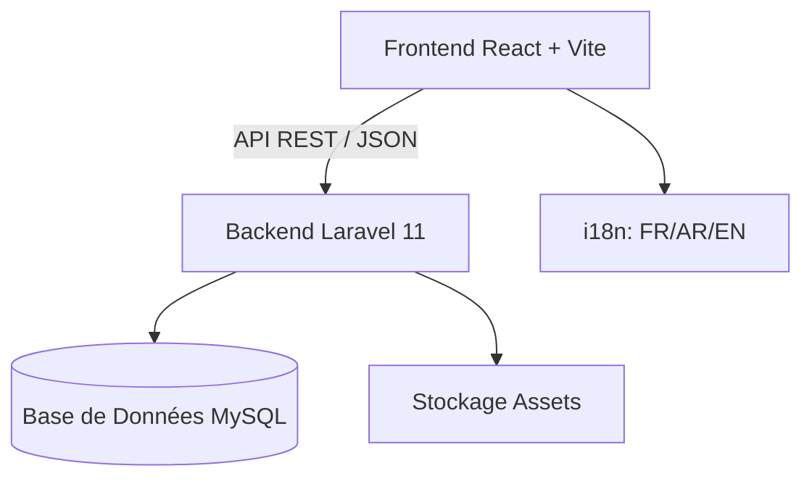

# Chapitre : Réalisations et Interfaces Graphiques

Ce chapitre présente les différentes interfaces de la plateforme **SOUK ✦**, illustrant l'aboutissement technique du projet. Chaque interface a été conçue selon une approche "User-Centric" (centrée utilisateur) afin de garantir une expérience fluide, intuitive et esthétiquement fidèle à l'identité visuelle de l'artisanat marocain.

---

## 1. Landing Page (Vitrine de la Plateforme)
La page d'accueil constitue le premier point de contact avec l'écosystème **SOUK ✦**. Elle remplit une double fonction : le branding et la conversion.

*   **Objectif :** Présenter la proposition de valeur de la plateforme.
*   **Design :** Utilisation d'un thème sombre (Dark Mode) avec des accents "Emerald" et "Gold". Les motifs de Zellige et les typographies modernes (Outfit) renforcent l'aspect premium.
*   **Fonctionnalité :** Navigation simplifiée, accès rapide à l'exploration des boutiques et mise en avant des catégories phares.

## 2. Authentification Multi-Rôles
La sécurité est au cœur du projet. Nous avons mis en place des interfaces d'authentification distinctes pour les vendeurs et les acheteurs, utilisant un design "Split-Layout" moderne.

*   **Description :** Le formulaire est séparé en deux sections sur desktop : une zone de branding visuel et une zone de saisie sécurisée.
*   **Sécurité :** Mise en œuvre de JWT (JSON Web Tokens) pour la gestion des sessions et hachage BCrypt pour les mots de passe.
*   **Responsive :** L'interface s'adapte dynamiquement, passant d'un écran partagé sur PC à une pile verticale épurée sur mobile.

## 3. Tableau de Bord Vendeur (Vendor Dashboard)
Une fois connecté, le vendeur accède à un centre de commande complet pour piloter son activité.

*   **Composants :** Menu latéral escamotable, widgets de statistiques rapides (Ventes du jour, Commandes en attente) et actions rapides.
*   **UX :** Priorisation des informations critiques pour permettre une gestion efficace en un coup d'œil.

## 4. Processus de Création de Boutique (SaaS Onboarding)
Le concept SaaS de **SOUK ✦** permet à n'importe quel artisan de générer sa propre boutique en quelques clics via un assistant (Wizard).

*   **Étapes :** Informations du compte -> Configuration de la boutique (Nom, Slug personnalisé) -> Validation.
*   **Multi-tenant :** Chaque boutique dispose d'un identifiant unique (slug) qui permet d'isoler ses données tout en partageant la même infrastructure logicielle.

## 5. Catalogue de Produits Dynamique
L'affichage des produits utilise un système de grille responsive optimisé pour la navigation.

*   **Technique :** Utilisation d'une "Responsive Grid" qui ajuste automatiquement le nombre de colonnes selon la largeur de l'écran (Desktop, Tablette, Mobile).
*   **Détails :** Chaque fiche produit (Card) inclut des images haute résolution, le prix et un indicateur de stock, avec des effets de survol fluides.

## 6. Gestion du Catalogue (Ajout de Produits)
Le formulaire d'ajout de produit est conçu pour être complet tout en restant simple d'utilisation pour des utilisateurs non-techniques.

*   **Champs :** Titre, description enrichie, gestion multicatégorie, prix et téléchargement d'images multiples.
*   **Validation :** Contrôle des données côté client (React) et côté serveur (Laravel FormRequests).

## 7. Gestion des Commandes (Order Management)
Ce module permet le suivi du cycle de vie des ventes.

*   **Suivi de Statut :** Système chromatique pour les statuts (Vert pour "Livré", Orange pour "En cours", Rouge pour "Annulé").
*   **Historique :** Liste chronologique détaillée permettant d'accéder aux informations de livraison du client.

## 8. Processus de Commande (Checkout)
Le parcours d'achat a été optimisé pour maximiser le taux de conversion.

*   **Flux :** Panier -> Détails de livraison -> Confirmation.
*   **Expérience :** Récapitulatif clair des articles et calcul automatique des totaux.

## 9. Interface d'Administration (Admin Panel)
L'administrateur de la plateforme dispose d'une vue globale sur l'ensemble de l'écosystème.

*   **Fonctions :** Gestion des utilisateurs, modération des boutiques et surveillance de la santé du système.

## 10. Analyse et Visualisation de Données
L'importance de la donnée est soulignée par des outils de visualisation intégrés.

*   **Graphiques :** Utilisation de bibliothèques de chartes pour afficher les tendances de revenus et le volume des ventes sur différentes périodes.

## 11. Paramètres et Configuration
Chaque utilisateur peut personnaliser son expérience via une page de paramètres dédiée (Profil, Sécurité, Configuration de la boutique).

---

## 12. Architecture du Système

### Schéma Conceptuel (UML)
Le diagramme suivant illustre l'interaction entre les acteurs et le système :

### Architecture Technique
La plateforme repose sur une architecture moderne découplée (Headless) :

*   **Frontend :** SPA (Single Page Application) assurant une fluidité maximale.
*   **Backend :** API robuste avec authentification Stateless (Sanctum/JWT).
*   **Multi-tenant :** Isolation logique des données par `store_id`.
